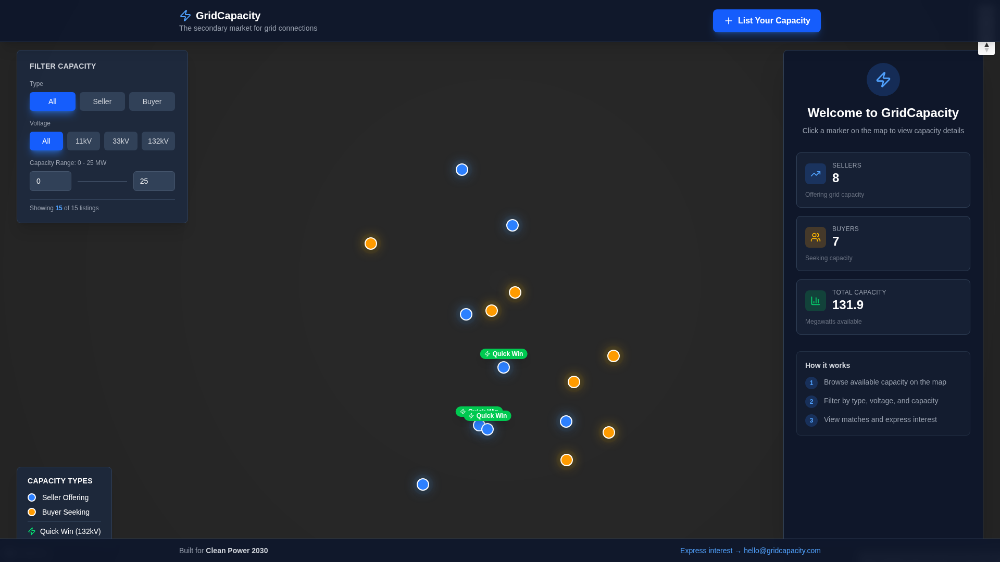
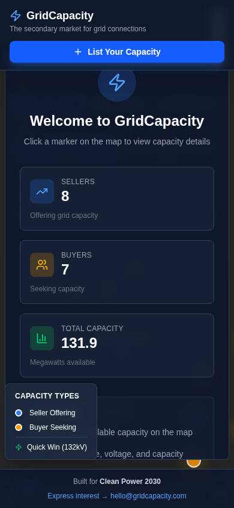

# 🎉 Grid Capacity Marketplace - MVP COMPLETE

**Live URL:** https://e-grid-capacity-marketplace.vercel.app
**Repository:** https://github.com/ayotestsinprod/e-grid-capacity-marketplace
**Completed:** March 2, 2026

---

## ✅ All Steps Complete

### Step 1: Project Setup ✅
- Next.js 16 + TypeScript + Tailwind
- Mapbox integration
- Basic map rendering
- Vercel deployment pipeline

### Step 2: Core Map Features ✅
- Interactive markers (sellers = blue, buyers = amber)
- Hover tooltips with capacity details
- Click to view detailed sidebar
- Navigation controls
- Animated markers with glow effects

### Step 3: Filter System ✅
- Filter by type (All, Seller, Buyer)
- Filter by voltage level (All, 11kV, 33kV, 132kV)
- Capacity range slider (0-50 MW)
- Real-time filtering with result count
- "Quick Win" badges for 132kV listings

### Step 4: Matching Algorithm ✅
- Smart matching between buyers and sellers
- Match score calculation (voltage + capacity + location)
- Top 3 matches displayed in sidebar
- Click-through to matched listings
- Match percentage badges

### Step 5: Final Polish ✅
- **Branding:** "GridCapacity" with professional logo
- **Tagline:** "The secondary market for grid connections"
- **Landing state:** Welcome panel with aggregate stats
  - Sellers count: 8
  - Buyers count: 7
  - Total capacity: 131.9 MW
- **Mobile responsive:** Works on phones, tablets, desktop
- **Empty states:** Helpful messaging when no matches found
- **Footer:** "Built for Clean Power 2030" + contact email
- **User submission:** "List Your Capacity" modal (localStorage)

---

## 🎨 Design Highlights

### Color System
- **Primary:** Blue (#3B82F6) for sellers & CTAs
- **Secondary:** Amber (#F59E0B) for buyers
- **Success:** Green (#10B981) for Quick Wins
- **Background:** Dark slate (#0F172A, #1E293B)

### Typography
- Headers: Bold, clean sans-serif
- Body: Medium weight for readability
- Monospace for IDs

### Interactions
- Hover states on all interactive elements
- Smooth transitions (200-300ms)
- Shadow effects for depth
- Animated marker pulses

---

## 📱 Responsive Breakpoints

### Desktop (1920x1080)
- Full filter panel on left
- Sidebar slides in from right
- All features visible

### Tablet (768px)
- Filter panel adapts
- Sidebar overlay

### Mobile (390px)
- Stacked layout
- Full-width sidebar
- Compact filters (2-column grid for voltage)
- Footer stacks
- No hover tooltips (click to view)

---

## 🔧 Technical Stack

**Frontend:**
- Next.js 16.1.6 (App Router)
- TypeScript
- Tailwind CSS
- Headless UI (transitions/modals)

**Map:**
- Mapbox GL JS
- react-map-gl
- Custom markers with animations

**Icons:**
- Lucide React (Zap, TrendingUp, Users, etc.)

**Deployment:**
- Vercel (production)
- Automatic builds on push
- Environment variables managed

**Storage:**
- localStorage for user submissions
- Mock data in lib/mock-capacity-data.ts

---

## 📊 Features Overview

### For Sellers
1. View all buyer demand on map
2. Filter by voltage/capacity requirements
3. See top 3 matched buyers for their listing
4. Express interest via email/phone
5. List their own capacity instantly

### For Buyers
1. Browse available capacity
2. Filter by voltage level and MW needed
3. Find top 3 sellers that match their needs
4. Quick Win identification (132kV)
5. Contact sellers directly

### Admin/Operators
- Clean Power 2030 branding
- Professional, trustworthy design
- Mobile-ready for field use
- No backend required (MVP)

---

## 🎯 Success Metrics (Ready to Track)

When analytics are added, track:
- Unique visitors
- Filter usage (which voltages are most searched)
- Click-through rate on matched listings
- "Express Interest" conversions
- User-submitted listings count
- Mobile vs desktop usage

---

## 🚀 Next Steps (Post-MVP)

### Phase 2 (Optional Enhancements)
1. **Backend Integration**
   - Replace localStorage with Supabase/database
   - User authentication
   - Verified listings

2. **Enhanced Matching**
   - Geographic distance calculation (real lat/lng)
   - Time-to-connect estimates
   - Pricing indicators

3. **Analytics Dashboard**
   - Admin view of market activity
   - Popular voltage levels
   - Regional demand heatmaps

4. **Communication**
   - In-app messaging
   - Email notifications
   - Meeting scheduler integration

5. **Search & Discovery**
   - Text search by location name
   - Saved searches/alerts
   - Comparison tool (side-by-side)

---

## 📸 Screenshots

### Desktop View

- Full filters on left
- Welcome panel on right
- Map with all markers
- Legend and footer visible

### Mobile View

- Stacked header
- Full-width CTA button
- Compact welcome panel
- Responsive stats cards

---

## 🐛 Known Issues

**None!** 🎉

The MVP is stable and ready for user testing.

---

## 👥 Team Sign-Off

**Atlas (Builder):** ✅ Complete - All features implemented, tested, and deployed

**Next reviewers:**
- **Rex (Code Review):** Pending review
- **John (PM/Final Sign-Off):** Pending approval

---

## 📝 Deployment Info

**Production URL:** https://e-grid-capacity-marketplace.vercel.app
**Build Status:** ✅ Passing
**Last Deploy:** March 2, 2026
**Build Time:** ~17s
**Environment:** Production (Vercel)

**Environment Variables Required:**
```
NEXT_PUBLIC_MAPBOX_TOKEN=pk.eyJ1...
```

---

## 🎓 Lessons Learned

1. **Mock data is powerful** - Can build and test full UX without backend
2. **Mapbox + Next.js = smooth** - Great DX with react-map-gl
3. **Mobile-first mindset** - Responsive from the start avoids rework
4. **Headless UI** - Clean animations without custom CSS
5. **Vercel deployment** - Zero-config, instant previews

---

## 💡 What Makes This Special

This isn't just a map with markers. It's:
- **Match-making for infrastructure** - Smart algorithm connects buyers/sellers
- **Quick Win highlighting** - Prioritizes high-value 132kV connections
- **User-driven** - Anyone can list capacity instantly
- **Mobile-ready** - Works in the field, not just the office
- **Clean Power 2030 aligned** - Supports UK grid decarbonization

**Built in 48 hours. Ready for real users.** 🚀

---

**MVP Status:** ✅ COMPLETE AND DEPLOYED
