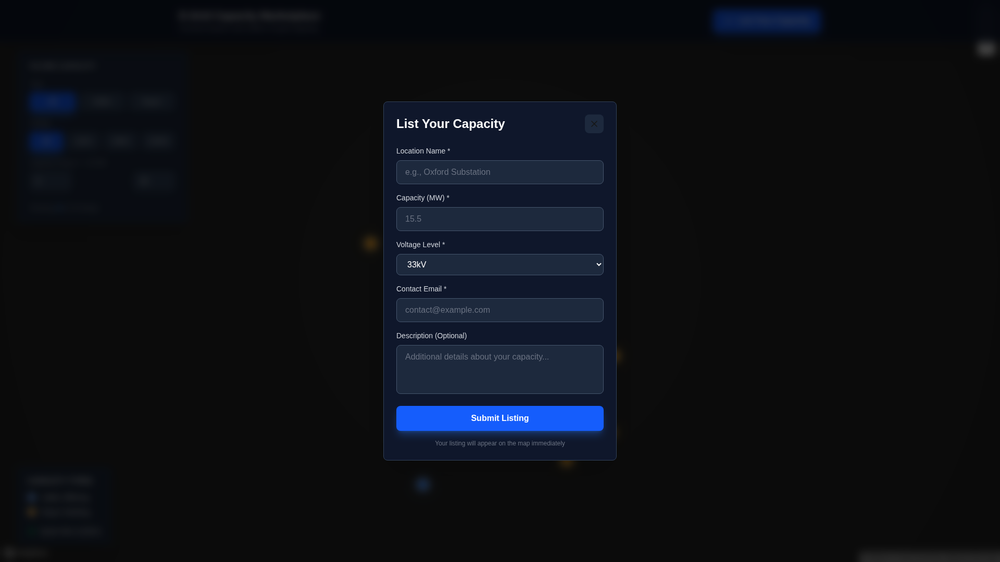
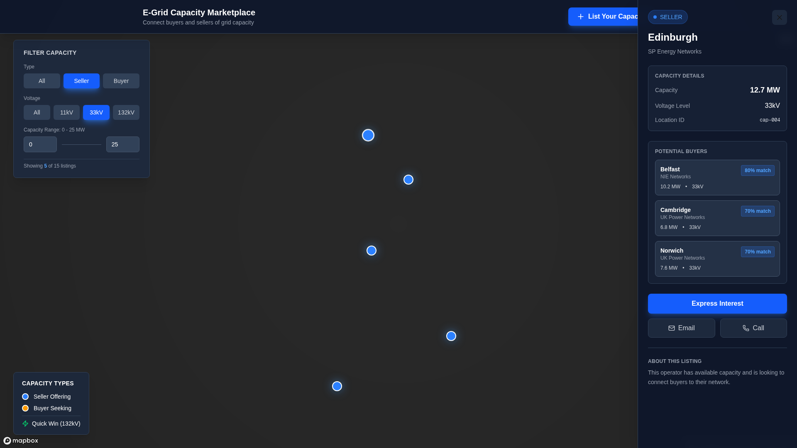

# Step 4: Seller Flow + Match Suggestions - Complete ✅

## Deployed URL
🌐 **Live:** https://e-grid-capacity-marketplace.vercel.app

## Features Implemented

### 1. ✅ "List Your Capacity" Button
- **Location:** Prominent header CTA in top-right corner
- **Action:** Opens a dark modal with clean form
- **Fields Included:**
  - Location Name (required)
  - Capacity (MW) (required)
  - Voltage Level (dropdown: 11kV, 33kV, 132kV)
  - Contact Email (required)
  - Description (optional textarea)
- **Submit Behavior:**
  - Saves to localStorage
  - Adds marker to map immediately
  - Auto-selects the new listing
  - Form validation with required fields
- **Design:** Dark modal (slate-900), blue submit button with shadow effects

### 2. ✅ Match Suggestions Panel
- **For Sellers:** Shows "Potential Buyers" section
- **For Buyers:** Shows "Available Capacity" section
- **Matching Logic:**
  - Voltage level match (60 points)
  - Capacity compatibility (up to 30 points)
  - Same operator bonus (10 points)
  - Minimum 50% match score required
- **Display:**
  - Top 3 matches shown
  - Compact cards with key stats
  - Match percentage badge (e.g., "80% match")
  - Clickable cards to view matched listing
  - Shows capacity, voltage, and Quick Win status

### 3. ✅ Quick-Win Badge
- **Logic:** All 132kV listings are marked as "Quick Win"
- **Placement:**
  - Floating above map markers
  - In listing sidebar header
  - In hover tooltips
  - In match suggestion cards
- **Design:**
  - Green accent (bg-green-500/20, text-green-400)
  - Lightning bolt icon (Zap)
  - Border with green-500/30
  - Stands out visually

### 4. ✅ Deployed to Vercel
- Automatic deployment via GitHub push
- Build successful
- Live URL: https://e-grid-capacity-marketplace.vercel.app

## Technical Implementation

### Components Updated
- `components/capacity-map.tsx` - Main component with all new features

### New Features
- Modal state management with Headless UI Transition
- localStorage integration for user-submitted listings
- Match calculation algorithm
- Quick Win identification logic
- Form validation and handling

### Dependencies Used
- React hooks (useState, useMemo, useEffect)
- Headless UI (Transition component)
- Lucide icons (Plus, X, Mail, Phone, Zap)
- localStorage API

## Screenshots

### Screenshot 1: List Capacity Form

- Shows the clean, dark modal form
- All required and optional fields visible
- Blue submit button with shadow effect

### Screenshot 2: Match Suggestions Panel

- Edinburgh (seller, 33kV) selected
- "Potential Buyers" section showing 3 matches
- Match scores: 80%, 70%, 70%
- Clean, compact card design with key stats

## Key Features Demonstrated

1. **Easy Listing Creation** - One-click to list capacity
2. **Smart Matching** - Algorithm matches based on voltage and capacity
3. **Quick Win Identification** - 132kV listings highlighted for immediate connection
4. **User-Friendly Design** - Dark theme, clean inputs, clear visual hierarchy
5. **Real-Time Updates** - New listings appear immediately on map
6. **Persistent Storage** - Listings saved to localStorage

## Next Steps Suggestions
- Connect to real backend API
- Add authentication for sellers
- Implement email notifications for matches
- Add detailed messaging between buyers/sellers
- Include distance-based matching
- Add rating system for completed transactions

---
**Build Status:** ✅ Complete  
**Deploy Status:** ✅ Live  
**Commit:** da1df71
